<p align="center">
  
</p>

<p align="center">
  Full-stack fashion ecommerce app inspired by Zara.
  <br /><br />
  <a href="https://trailer-ecommerce.vercel.app">Live Demo</a>
</p>

> **Disclaimer:** Portfolio project only. I don't own any of the product images or branding — all assets are from Zara/Inditex and used strictly for demo purposes. Not affiliated with or endorsed by Zara. Not for commercial use.


## What is this

Trailer is a fashion ecommerce site I built to learn full-stack development properly. I wanted to go beyond tutorials and actually build something that works end-to-end — browsing products, adding to cart, checking out, paying with Stripe, and CRUD operations as an admin dashboard.

There's also an admin side where you can manage products, categories, and the homepage layout.

## Tech

- **Next.js 15** (App Router) + **TypeScript**
- **Tailwind CSS 4** for styling
- **Supabase** for database and auth
- **Stripe** for payments
- **Zustand** for state management
- **Radix UI** + **Shadcn** for UI components
- Deployed on **Vercel**

Also using: next-themes, react-icons, react-select, sharp, lucide-react, clsx

## Features

- Browse by category/subcategory, search products
- Product pages with image galleries
- Cart sidebar + full shopping bag page
- Checkout with shipping options and Stripe integration
- Auth with email/password, Google, GitHub, and password reset
- Account page with order history and settings
- Admin dashboard for products, categories, and homepage content management (restricted via an `is_admin` table in Supabase that checks the user's UUID — only manually added users can access admin routes)
- Dark mode
- Responsive (mobile, tablet, desktop)
- SEO with dynamic metadata and Open Graph

## Pages

```
/                              homepage
/[category]                    category page
/[category]/[sub-category]     product grid
/[category]/[sub]/[product]    product detail
/shopping-bag                  cart
/checkout                      checkout + stripe
/search                        search
/login, /signup                auth
/account/*                     user account (details, purchases, settings, help)
/admin/*                       admin dashboard (products, categories, content)
```

## Running locally

You need Node 18, a Supabase project, and a Stripe account.

```bash
git clone https://github.com/pandeemiC/trailer-ecommerce.git
cd trailer-ecommerce
npm install
```

Create `.env.local`:

```env
NEXT_PUBLIC_SUPABASE_URL=your_supabase_url
NEXT_PUBLIC_SUPABASE_ANON_KEY=your_supabase_anon_key
STRIPE_SECRET_KEY=your_stripe_secret_key
STRIPE_WEBHOOK_SECRET=your_stripe_webhook_secret
NEXT_PUBLIC_SITE_URL=http://localhost:3000
```

Then `npm run dev` and open [localhost:3000](http://localhost:3000).

## Screenshots

|                 Hamburger Menu                 |                    Category Overview                     |                 Subcategory Page                  |
| :--------------------------------------------: | :------------------------------------------------------: | :-----------------------------------------------: |
| 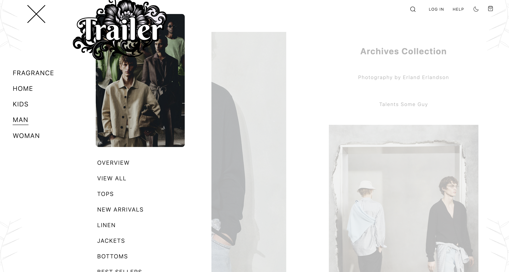 |  | 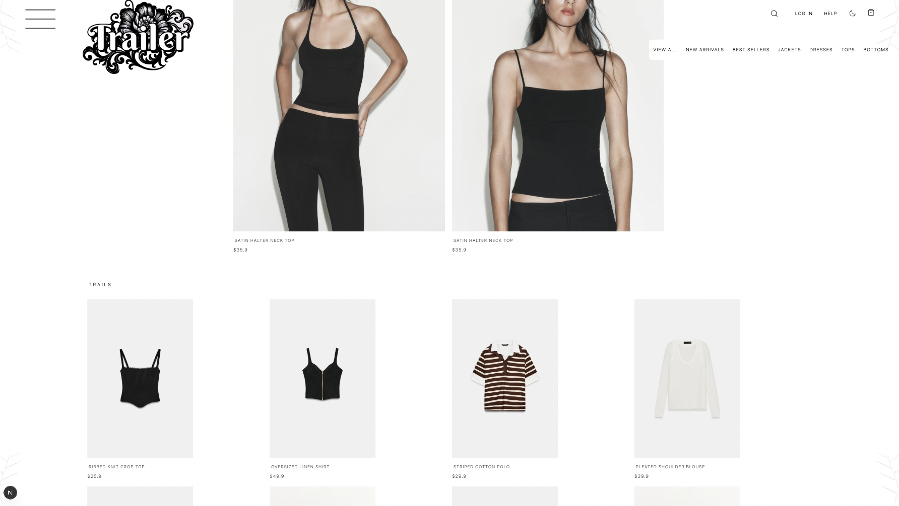 |

|                  View All                   |                Product Page                |                      Product Gallery                      |
| :-----------------------------------------: | :----------------------------------------: | :-------------------------------------------------------: |
| 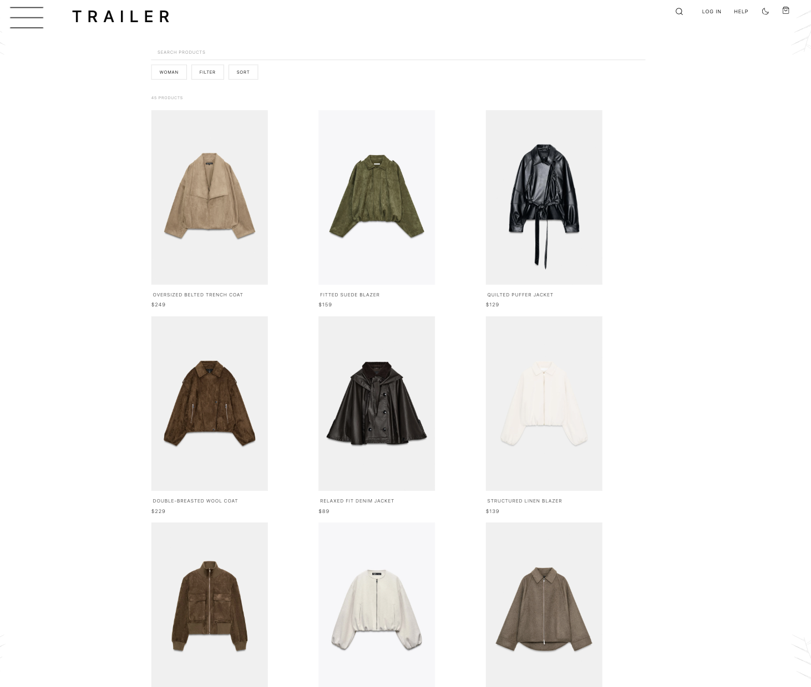 | 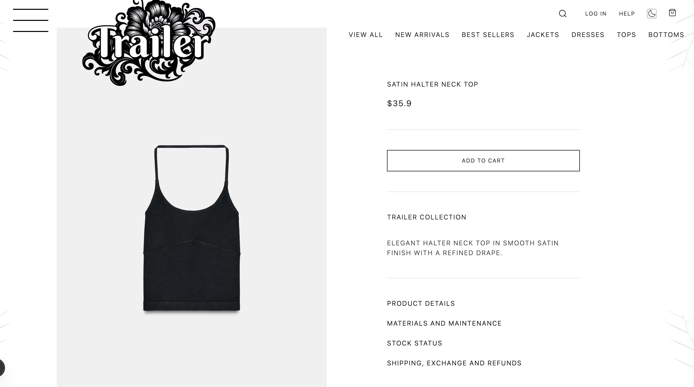 |  |

|                    Side Cart                     |                    Shopping Bag                     |                     Checkout                     |
| :----------------------------------------------: | :-------------------------------------------------: | :----------------------------------------------: |
| 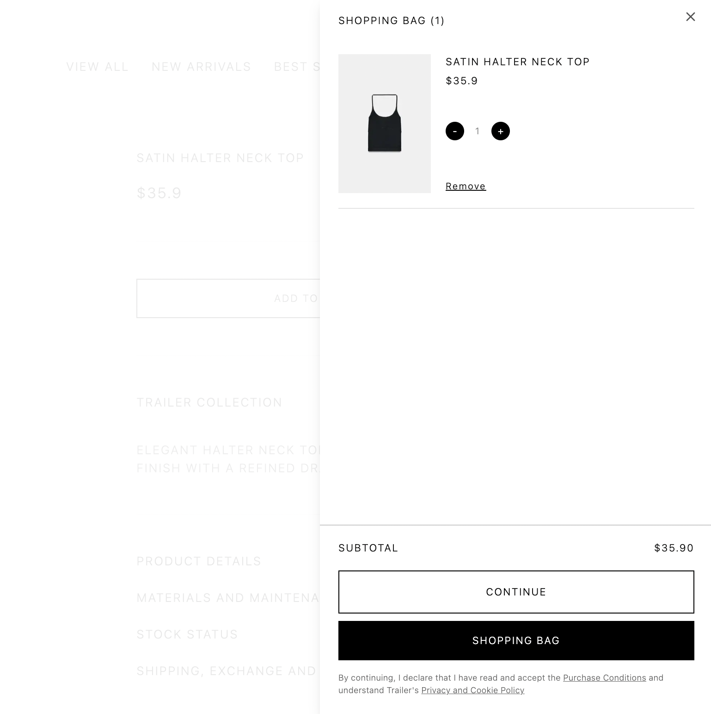 | 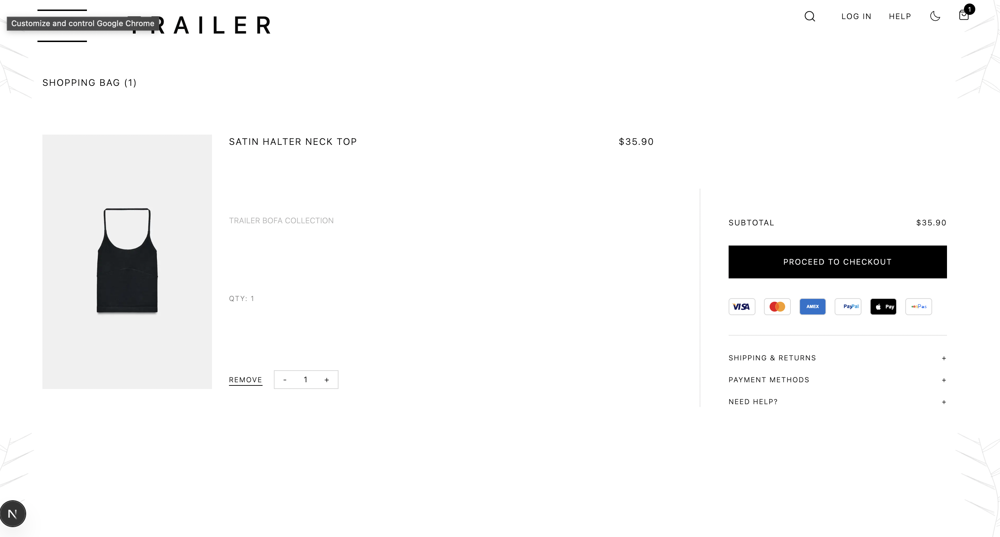 | 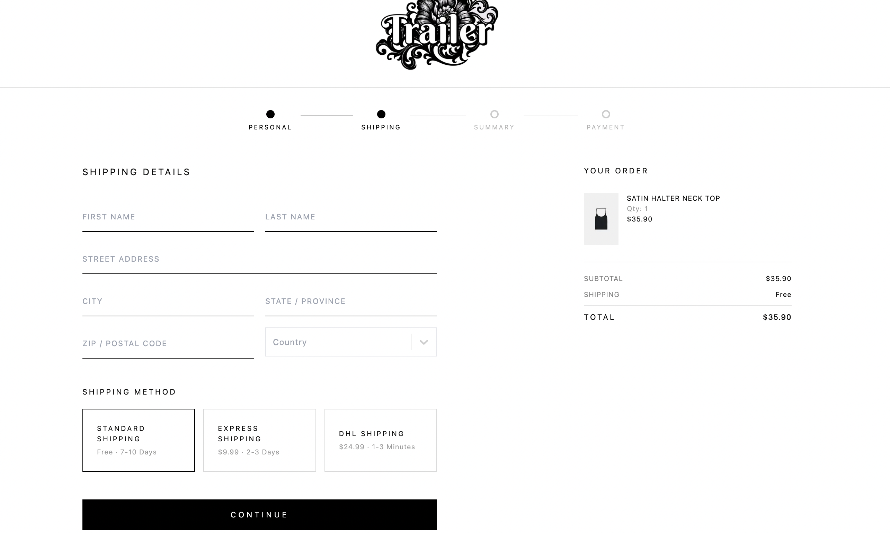 |

|                Stripe Payment                |
| :------------------------------------------: |
| 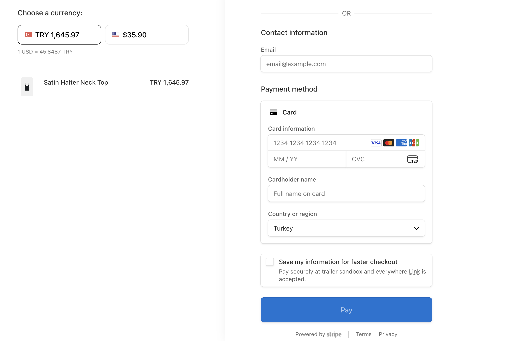 |

|                   Login                    |                      Admin Login                      |
| :----------------------------------------: | :---------------------------------------------------: |
|  | 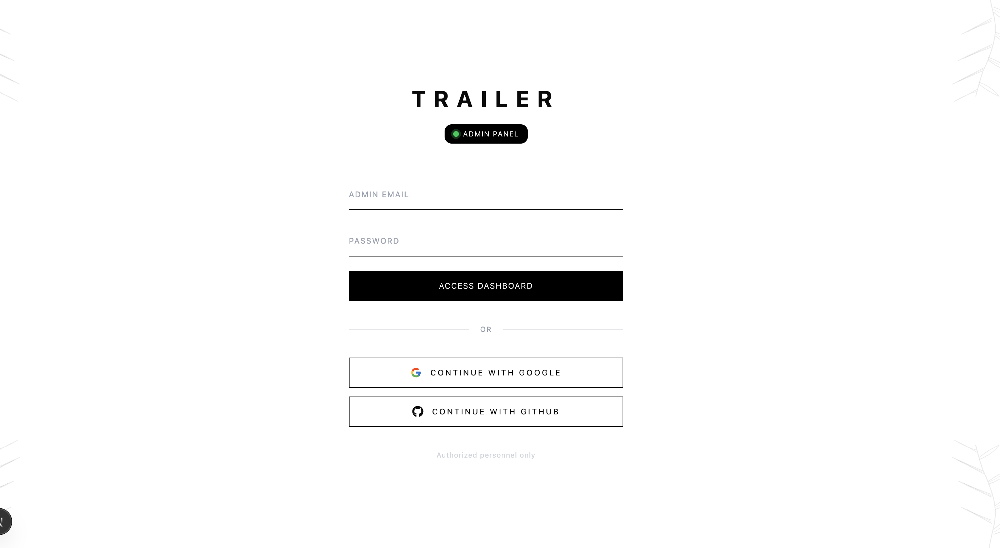 |

|                      Account Settings                       |                     Order History                     |
| :---------------------------------------------------------: | :---------------------------------------------------: |
| 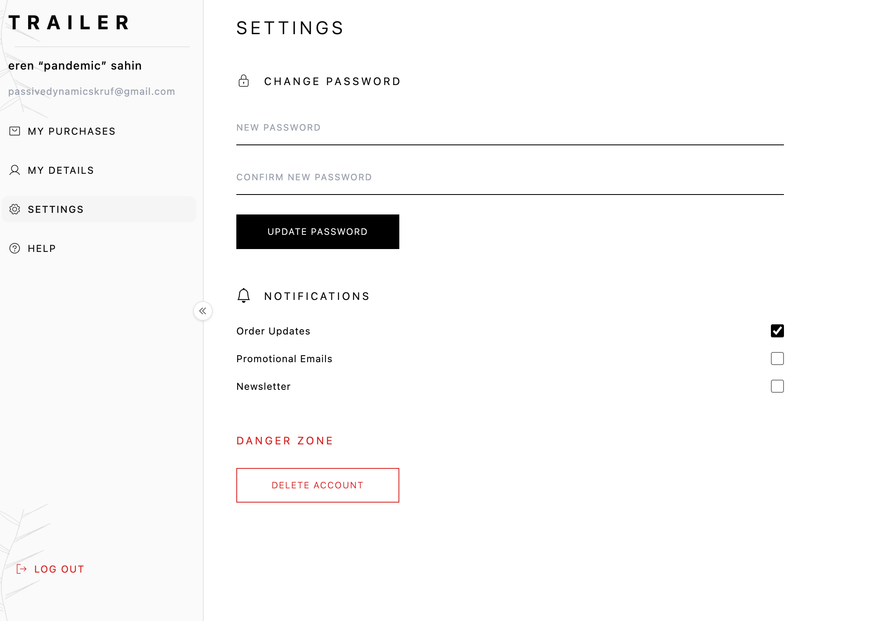 | 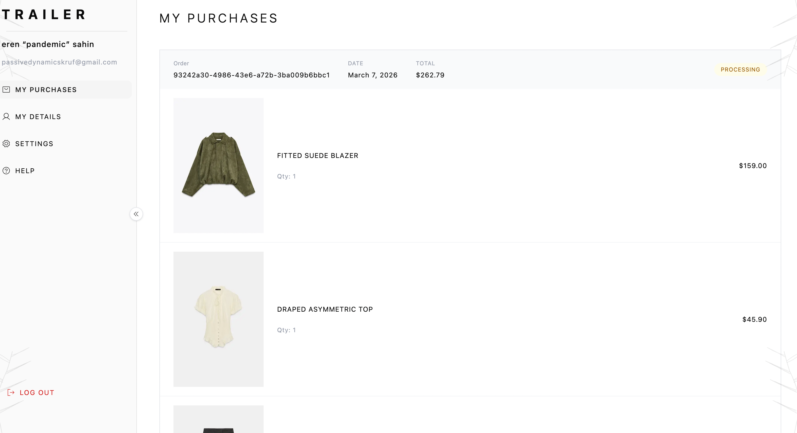 |

| Admin Dashboard | Admin Products | Admin Categories |
|:-:|:-:|:-:|
| 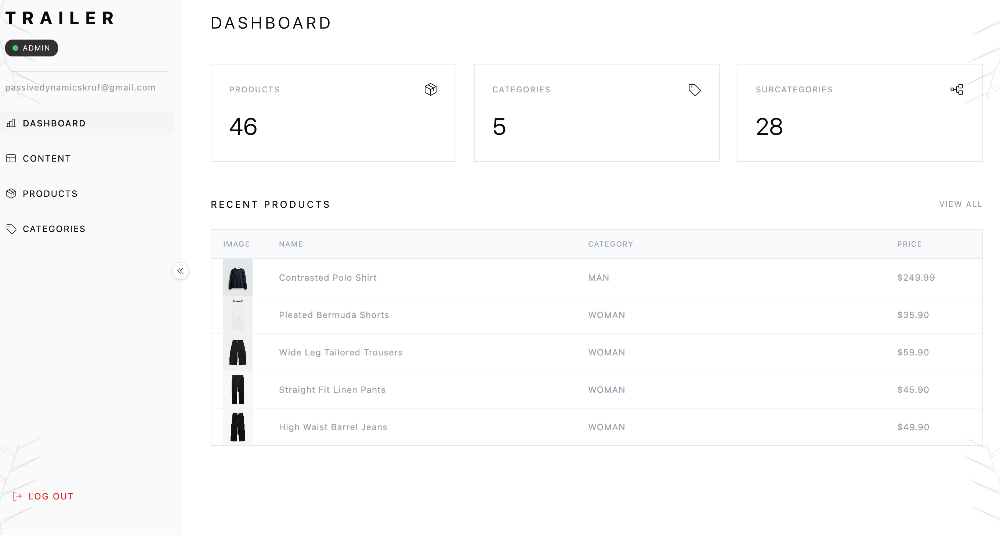 | 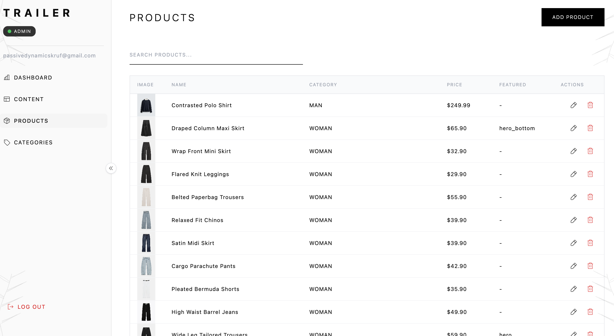 | 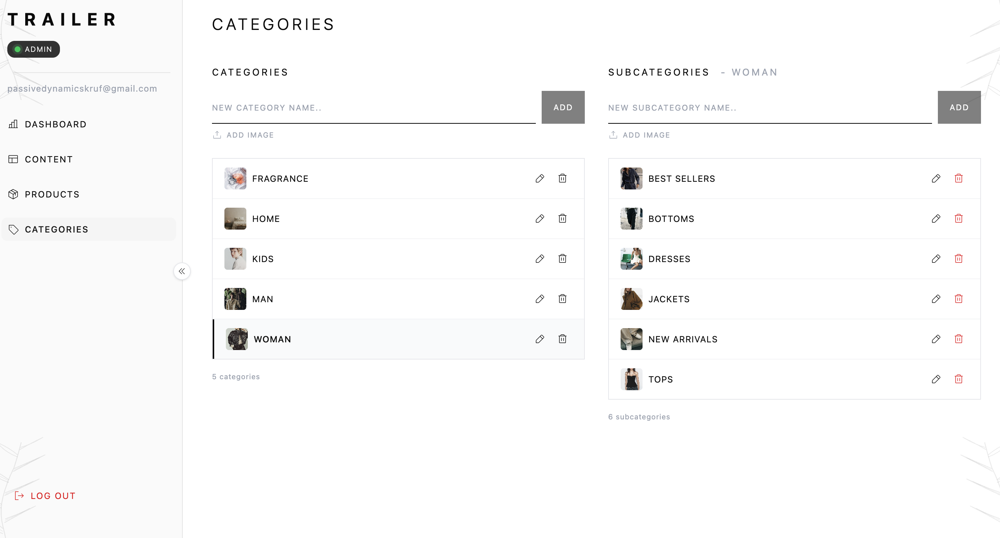 |

| Admin Content |
|:-:|
| 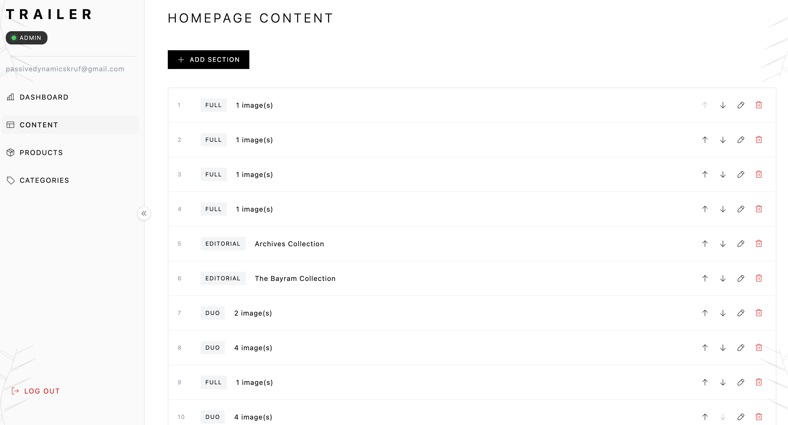 |
